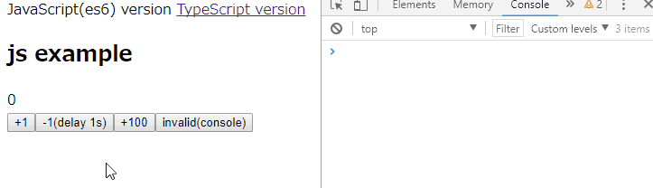

# Nanox Example Project

Simple counter application project using [Nanox](https://github.com/ktty1220/nanox).



## Install

Clone this repository, and execute below command.

```sh
$ npm install
```

```sh
$ npm run build
```

`index-js.js` and `index-ts.js` will be created.

After build, open `index.html` in your browser.

&copy; 2017 [ktty1220](mailto:ktty1220@gmail.com)
